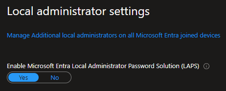
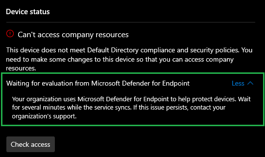
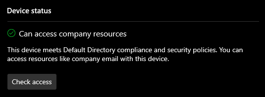
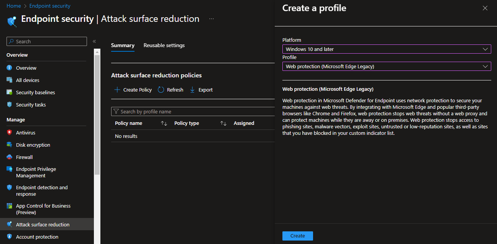
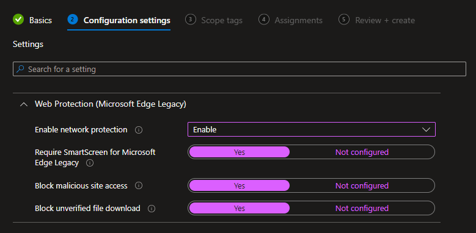
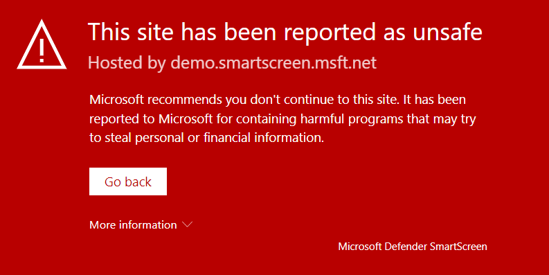
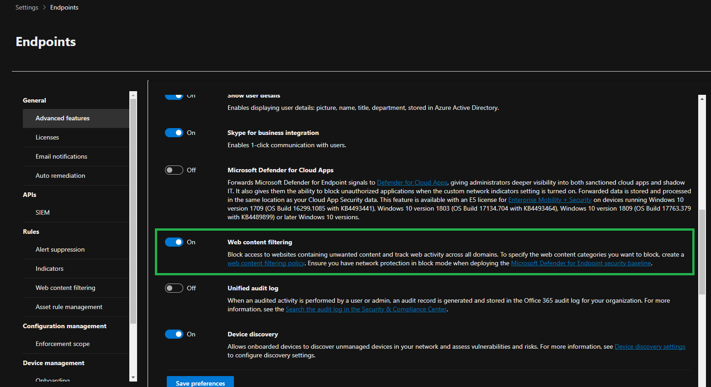

# Azure Endpoint Security

Sample resources for Intune, Defender for Endpoint, and more.

Set the variables file:

```sh
cp config/template.tfvars .auto.tfvars
```

Check for the latest [Windows images](#windows-11-images) available.

Create the resources:

```sh
terraform init
terraform apply -auto-approve
```

A user `IntuneAdmin@yourdomain` will be created with the following permissions:

- `Intune Administrator`
- `Security Administrator`

This will allow access to the following applications:

- https://intune.microsoft.com
- https://security.microsoft.com

An appropriate license needs to be assigned to the user in order to activate Intune.

## Defender for Endpoint

Connect MDE with Intune. (Microsoft Intune Plan)

> 💡 An addon or equivalent [license][1] needs to be purchased for this integration.

Microsoft Defender Antivirus [works together][2] with Microsoft Defender for Endpoint

Intune EDR policy (onboard)

This [video][3] shows how to configure Device Guard with Microsoft Intune.

> 💡 Device guard - Prevents malicious code from running by ensuring only allowed and known good code can run, such as malware or ransomware. (Only Windows Enterprise client)

Among other available services is [controlled folder access][4].

## Company Portal

A license is also required. EDR enables Azure Advanced Threat Protection

Make sure to also allow MDM user scope to enroll (Mobility MDM and WIP) - Microsoft Intune

> 💡 This helpful video shows how to enable Defender for Endpoint.

## LAPS

For Local Administrator Password Solution (LAPS), make sure you've enabled it in the device settings blade:



In Intune, create an account protection policy:

1. Select Endpoint security > Account protection > Create policy
2. Select Windows 10 and Windows LAPS
3. Create the policy for all devices

## Intune

If MDE is enabled, it can take a while after joining Intune until everything is synced.



Access will be granted after the compliance check:



## Web protection

This section shows [web protection][6].

### Attack Surface Reduction - Web protection

An example with Microsoft Edge:



Select the appropriate configuration for the profile:



To test SmartScreen, use a [sample URL][7], such as this [demo malware][8] page.



Security can be further enhanced with [Alerts][9], and monitoring can use [Reports][10].

### Defender - Web content filtering

With MDE, it is also possible to turn on web content filtering:



## Windows 11 images

To find updated Windows 11 images:

```sh
az vm image list-skus -l eastus2 -f Windows-11 -p MicrosoftWindowsDesktop --query [].name
```

Suffix are:

| Code | Column 2 Header |
| -------------- | -------------- |
|  avd             |        Azure Virtual Desktop       |
|   ent             |       Enterprise        |
|   entn             |     Enterprise (not with media player)           |
|   pro             |     Professional           |
|   pro-zh-cn             |     Simplified Chinese          |
|   pron             |     Professional (not with media player)           |


[1]: https://learn.microsoft.com/en-us/microsoft-365/security/defender-endpoint/microsoft-defender-endpoint?view=o365-worldwide
[2]: https://learn.microsoft.com/en-us/microsoft-365/security/defender-endpoint/why-use-microsoft-defender-antivirus?view=o365-worldwide
[3]: https://youtu.be/wAiH_lDveug
[4]: https://learn.microsoft.com/en-us/microsoft-365/security/defender-endpoint/enable-controlled-folders?view=o365-worldwide
[5]: https://www.youtube.com/watch?v=z3R_aq0pu0Y
[6]: https://learn.microsoft.com/en-us/microsoft-365/security/defender-endpoint/web-threat-protection?view=o365-worldwide
[7]: https://demo.wd.microsoft.com/Page/UrlRep
[8]: https://demo.smartscreen.msft.net/other/malware.html
[9]: https://learn.microsoft.com/en-us/microsoft-365/security/defender-endpoint/web-protection-response?view=o365-worldwide
[10]: https://learn.microsoft.com/en-us/microsoft-365/security/defender-endpoint/web-protection-monitoring?view=o365-worldwide
[11]: https://learn.microsoft.com/en-us/microsoft-365/security/defender-endpoint/web-content-filtering?view=o365-worldwide
